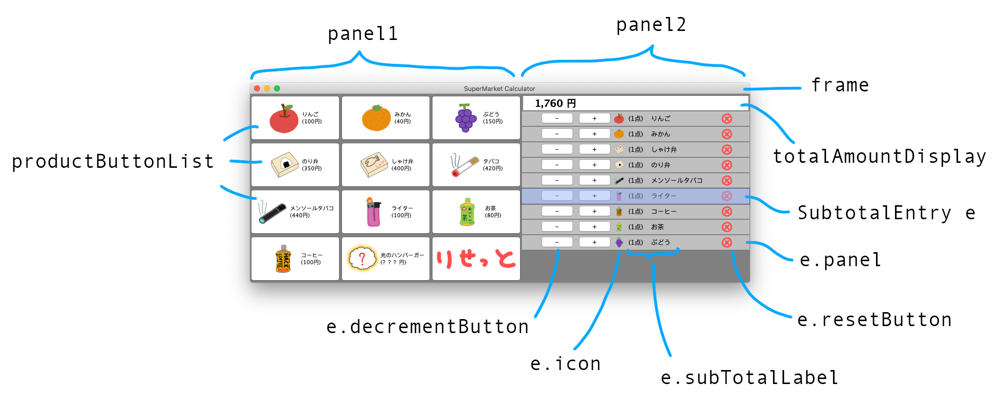

# About

This project implements a register used in a supermarket. The GUI is implemented using Java Swing. All the icons used in the GUI are drawn by me.

# Structure

|  |
|:-:|
| Structure |

# Usage

`./mvn.sh run com.gui.CalculatorGUI`

# Requirements

- `Java 11`

- `Maven`

# TODO

- Currently, `CalculatorGUI.cart` and `CalculatorGUI.subtotalEntryMap` are synchronized manually though they are semantically linked strongly.

